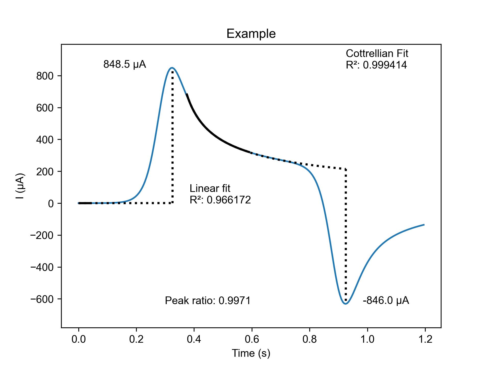

# diffusional-fitter

## Overview

This program analyses cyclic voltammetry (CV) data as a function of time and fits diffusional baselines, allowing for a more accurate measurement of return peak Faradaic current compared to linear methods. The program generates a plot showing the fitting and picked peaks, and a summary text document which contains some more detailed information. 

*Example of output plot from Diffusional Fitter program.*

More information about how the fitting is performed is described in our paper "More Accurate Measurement of Return Peak Current in Cyclic Voltammetry Using Diffusional Baseline Fitting" - https://doi.org/10.1021/acs.analchem.3c04181. If this program has been useful for your work we'd appreciate citation.

Exported data from CH Instruments, Nova, and PSTrace are currently supported. A template file is also available for users to input their own data manually.

## Basic usage

1. Download 'Diffusional Fitter.exe', and optionally 'template.csv' from the 'Sample data' folder.

2. Open 'Diffusional Fitter.exe'. Note that the executable can take some time to start when initially launched, but once the interface appears the program should be responsive.

3. Select your data format from the dropdown menu.

4. Use the 'Select CV file' button to select your text or CSV file, then the 'Select output folder' button to select a directory where the output plot and summary text file will be saved.
  
5. Select 'Run'. The program will generate an output plot and summary text file in your designated output folder. A success message will appear if the program ran without errors. 

## CV data requirements

- IUPAC format
- One pair of peaks (for example oxidation and subsequent reduction). Voltammograms with multiple oxidation and reduction peaks are not currently supported.
- Data is from the first scan (no diffusion layer). A linear fit from data prior to the first peak is used for capacitance/resistance correction. For this reason using diffusional fitter on repeated scans will result in erroneous fitting.

## Supported data formats
### Template CSV file
The CSV template can be used for data collected from any potentiostat. The user needs to input the experiment's scan rate (V/s), potential data (V), and current data (A) in a program like Excel. Take care when inputing data in scientific notation as some programs will round to three significant figures when the template copy is saved, resulting in current data with step artifacts. In Excel, formating these cells as 'General' should avoid this problem.

### CH Instruments text file
The exported data should be a text file with only the first two segments of your voltammogram. The program works with comma or tab delimited text files.

### Nova text file
Exports from Nova should use the following settings:  
  
File format: ASCII  
Write column headers: Yes  
Column delimiter: Comma (,)  
Decimal Separator: Period (.)  

Diffusional fitting only works on the first scan. The program will automatically remove data from subsequent scans if these data are included in the export.

### PSTrace CSV export
In PSTrace select 'Export data to CSV file...' under the 'Data' tab. This option in PSTrace will only export potential and current CV data, so the user will see an additional option pop up when running the program to input the experiment's scan rate. This input is used to calculate the time series data.

## Miscellaneous

- This program has been written to model the diffusional decay in CV experiments, thus using it to fit data with a significant amount of current from other electroactive species or adsorption will lead to poor fits or misleading results.

- The Shoup-Szabo function option is available for cases where radial diffusion becomes significant. However, as this function is less constrained than the Cottrellian option it can achieve a good fit even when this model is inappropriate. For this reason we recommend that the user chooses their own fitting range when using the Shoup-Szabo option, and that care is taken when interpretting your results.
